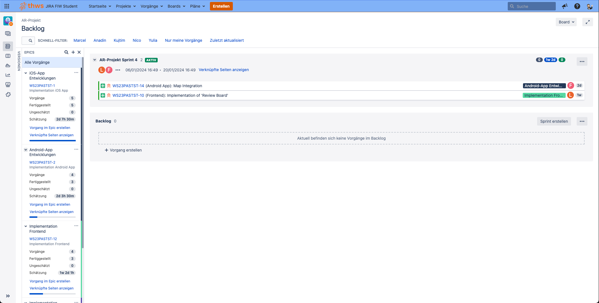
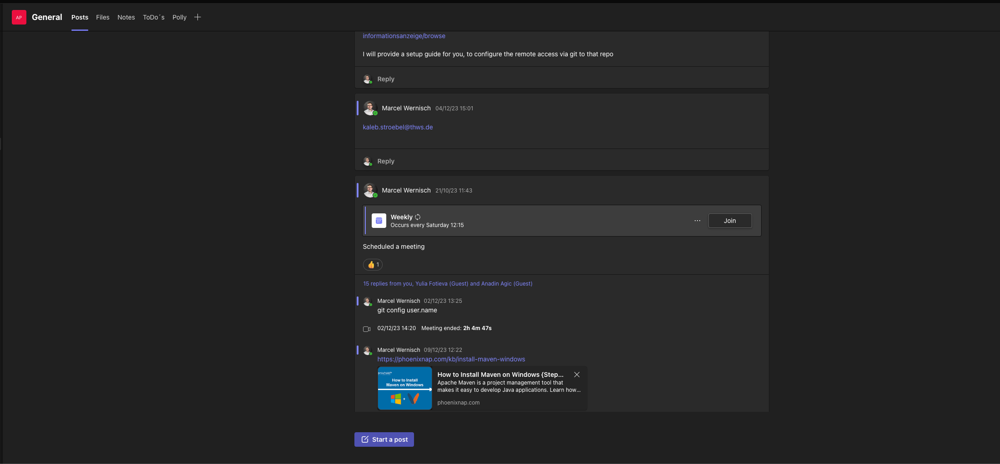
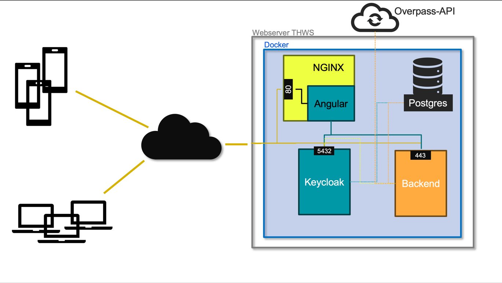
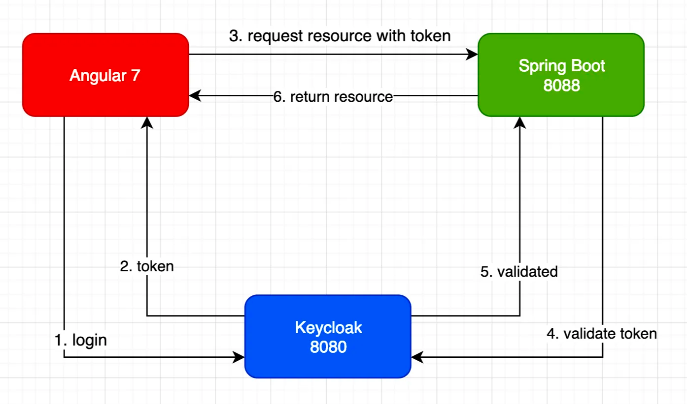
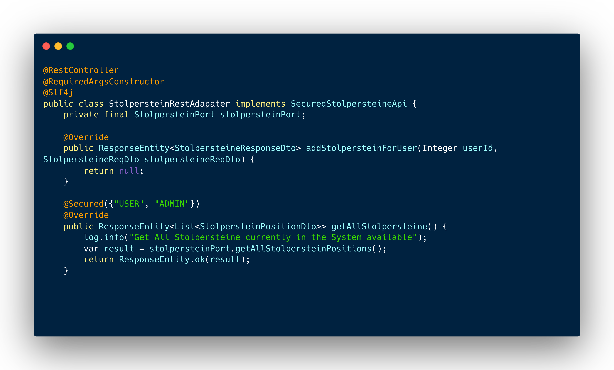
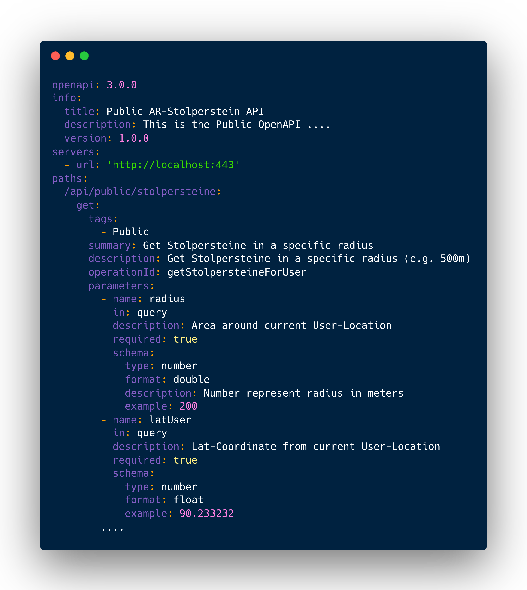

= THWS - ARStolpersteine Programmierprojekt
Anforderungsspezifikation
:doctype: book
:toc:
:toc-title: Inhaltsverzeichnis
:tabsize: 4

== 1. Motivation / Vision
Im Rahmen des 4. Semester wurde ein Programmierprojekt initiiert. Dieses Programmierprojekt dient, gelerntes in einem sehr praxisorientierten Projekt umzusetzen. Wir haben als Gruppe, verschiedene Projektvorstellungen gehabt und hatten uns folglich für das Projekt "GPS-basierte Stolpersteine mit AR Informationsanzeige" entschieden. Das Ziel der Anwendung ist, die virtuelle Welt mit der physischen Welt zu verbinden und Menschen die Möglichkeit geben, die Zeit um den Holocaust besser zu verstehen. Eine App-Lösung gibt es aktuell nicht. Begrenzungen der Anwendung liegt im Wesentlichen vor allem bei der Nutzung der App. Sie sollte möglichst einfach und ohne komplexe Strukturen bedienbar sein. Ebenso ist eine einfache und schnelle Interaktion zwingend notwendig, da sonst die User-Experience davon leidträgt.

== 2. Use Case Beschreibung
[plantuml,ermDiagram,svg,role=component]
[.text-center]
....
include::./diagrams/useCaseDiagram.puml[]
....

== 3. Essenzielle Funktionen
Die Funktionen der Anwendung werden in folgender Tabelle behandelt:

|===
|Funktion| Beschreibung
|Stolpersteine Anzeigen im Radius X der aktuellen Position| Wird die App geöffnet/ ist sie offen müssen die Stolpersteine in unmittelbarer Nähe der aktuellen Position angezeigt werden. Dabei muss jeder Stolperstein einzeln auf der Karte entsprechend markiert werden.

| Stolperstein-Informationen anzeigen | Wird von dem Nutzer ein Stolperstein ausgewählt, werden die passenden Informationen dem Nutzer zur Verfügung gestellt.

| Stolperstein AR-Ansicht | Wenn der Nutzer im Radius von 5 Meter ist, werden die Bilder, welche dem Stolperstein hinterlegt wurden, entsprechend der Ausrichtung die dem Bild mitgegeben wurde angezeigt (Norden, Süden, Osten, Westen). Dabei werden die Bilder entsprechend angezeigt, sobald das Handy in die Himmelsrichtung schaut. Eine Möglichkeit weitere Informationen über den Stolperstein zu erhalten, soll auf dem Display untergebracht werden. Ein Hinweis, falls kein Stolperstein sich in der Nähe befindet, muss auch gegeben sein.

| Stolpersteine sollen von der Overpass API genutzt werden | Overpass API hat aus ganz Deutschland, Stolpersteine gespeichert. Diese sollen als Datengrundlage für das System dienen. Die Änderungen eines Nutzers werden auf Basis der Overpass-API durchgeführt.

| Anpassung der Stolpersteine | Stolpersteine sollen über ein entsprechendes Portal, durch einen Nutzer, angepasst werden können. Dabei ist essenziell, dass neben der Validierung der Felder auch ein Bildupload mit entsprechender Himmelsrichtung möglich ist. Die Bilder müssen auch so abgespeichert werden, dass bei einer gleichen Benennung durch unterschiedliche User kein Konflikt entsteht.
|===

== 4. Projektorganisation

=== 4.1 Projektorganisationsmethode
Wir haben uns für das Verfahren Scrum entschieden. Dabei ist Scrum ein agiles Projektmanagement-Framework, das Teams dabei unterstützt, komplexe Aufgaben in kurzen Entwicklungszyklen, sogenannten Sprints, zu bewältigen. Es basiert auf den Prinzipien der Transparenz, Inspektion und Anpassung, wobei Teams regelmäßig ihre Fortschritte überprüfen und anpassen, um schnell auf Veränderungen reagieren zu können. Scrum definiert klare Rollen wie den Product Owner, der die Anforderungen priorisiert, den Scrum Master, der das Team unterstützt und Hindernisse beseitigt, sowie das Entwicklungsteam, das die Arbeit während des Sprints erledigt. Durch regelmäßige Meetings wie das Sprint Planning, das Daily Scrum und das Sprint-Review wird eine transparente Kommunikation innerhalb des Teams gefördert, was zu einer effizienten und kollaborativen Arbeitsweise führt.

Für uns bedeutete das wir uns in einem eigens geführten Weekly, über den aktuellen Stand ausgetauscht haben. Probleme und offene Punkte wurden besprochen und Blocker versucht direkt zu beheben. Neben diesem Weekly wurden dann noch ein Weekly mit Prof. Dr. Nicolas Müller abgehalten, um auch hier in einem regelmäßigen Austausch zu stehen. Hier wurden ebenso Probleme, Blocker und offene Themen angesprochen und ggf. von Prof. Müller unterstützend gelöst.

=== 4.2 Software zur Organisation
Zur besseren Organisation der Sprints nutzten wir Atlassian Jira. Dabei erstellten wir unter anderem das Sprint-Board für unser Team und hatten folgende Kategorisierung:

==== Epics

Epics werden genutzt, um verschiedene Teilkomponenten eines PIs zu bündeln und darunter Stories, Task, Bugs zu organisieren. Als Projektverantwortlicher bekommt man durch Epics einen schnellen Überblick, über den aktuellen Fortschritt und würde zudem schnell Abweichungen erkennen, wie beispielweise Mehraufwand.

==== Stories
Stories, meist auch bekannt als User stories sind fachliche Aufgaben, in denen eine (bestehende) Funktion abgeändert wird aus fachlicher Sicht. Der Grund der Änderung an dem Produkt ist also rein fachlich getrieben. Dabei ist wichtig, dass in der Definition der Stories entsprechend die Akzeptanzkriterien festgelegt werden, an denen die Erfüllung der Aufgabe gemessen werden kann.

==== Tasks
Tasks sind meist technischer Natur. Es sind also Änderungen an dem Produkt die aus technischer Sicht gefordert worden. Hier sind Akzeptanzkriterien gewünscht aber nicht immer zwingend notwendig. Ziel eines Tasks, ist immer eine technische Verbesserung des bestehenden Systems.

==== Bugs
Bugs sind Fehler oder Defizite in der Anwendung, die beim Testen oder in der Integration anderer Tasks auffallen. Für Bugs muss zwingend eine Fehlerbeschreibung und eine Anleitung zur Fehlwiederherstellung vorhanden sein. Ein Bug hat kein Akzeptanzkriterium.

.Jira Übersicht des Backlogs mit den genannten Epics und offenen Stories

=== 4.3 Team Struktur/ Rollen
Durch die Entscheidung, für das Scrum-Framework müssen folgende Rollen von Personen besetzt werden:

- Scrum Master
- PO
- Development Team

Aufgrund der begrenzten Anzahl der Teammitglieder war dies aber nicht ganz realisierbar.

Das Development-Team bildete sich aus allen Teammitgliedern. Die Rolle des Product Owners und Scrum Masters hat Marcel Wernisch übernommen.

=== 4.4 Kommunikationswege
Für das Projekt nutzten wir zwei unterschiedliche Kommunikationswege. Zum einen nutzten wir eine erstellte Teams-Instanz, um Datei-Sharing, offene Themen, FAQs und Meetings organisieren zu können.

.Ausschnitt Teams

Neben diesem Kommunikationsmittel nutzten wir für die schnelle und einfachere Kommunikation eine Whatsapp-Gruppe. Die Gruppe diente als schneller Kommunikationsweg für Blocker, Probleme, Fragen oder allgemeine Informationen.

=== 4.5 Probleme bei der Umsetzung von Scrum
Nach dem Kickoff-Termin des Seminars wurden schnell die Gruppen definiert und Gespräche mit den Projektverantwortlichen geführt. Nach Annahme des Projekts wurde dann das Konzept der Projekte definiert und so hatten wir uns auch für das Scrum-Framework entschieden. Gründe waren hierfür unter anderem die Vorkenntnisse aus dem Team, im Umgang mit Scrum in Softwareprojekten. Bei der dann folgenden Realisierungsphase des Projekts zeigt sich die Wahl des Scrum-Frameworks als Fehler. Durch die sehr beschränkte Entwicklungszeit, waren wir gezwungen die Sprints kurz zuhalten. Da aber keiner der Teammitglieder wirklich zu 100 % an dem Projekt arbeiten konnte, aber die Sprints durch den knappen Zeitplan trotzdem mit Stories und Tasks durchgeplant werden mussten, wurden regelmäßig die Sprintziele gerissen. Neben dem knappen Zeitplan kam dann noch der Faktor des unterschiedlichen Wissensstands hinzu. Dadurch konnten nicht jeden Sprint die Aufgaben passend verteilt werden und offene Aufgaben wurden auf Zuruf erledigt. So wurden keine expliziten Tasks im Jira erstellt und somit wurden auch das Task-Tracking komplett vernachlässigt. Durch das fehlende Task-Tracking konnten wir auch den typischen Sprint-Rythmus nicht erfüllen. Im Nachhinein betrachtet hätten wir nun lieber auf das KANBAN-Prinzip gesetzt.

== 5. Technische Dokumentation
Im Folgenden betrachten wir die Anwendung aus der technischen Sichtweise. Gehen hierbei auf die Architektur, technische Realisierung und Besonderheiten ein.

=== 5.1 Architektur/ Aufbau der Anwendung

.Die Anwendungsarchitektur im Überblick

==== 5.1.1 Backend-Applikation
Aufgrund von Vorkenntnissen war schnell klar, dass die Wahl auf eine Java-Anwendung im Backend fallen wird. Hierfür bieten sich unterschiedliche Möglichkeiten für einen Einsatz als Server ein, um nur ein paar zu nennen:

- JavaEE/ JakartaEE auf einem Tomcat o.ä.
- JavaEE/ JakartaEE auf eine Application Server wie Wildfly
- Spring-Boot Framework

Für die Auswahl der richtigen Serverlösung, sollten weitere Aspekte in Betracht gezogen werden. Beispielsweise, ob die Anwendung als Microservice oder Java-Monolith aufgebaut wird. Nachdem alle Aspekte beleuchtet wurden, fiel die Wahl auf das Spring-Boot Framework, dabei wird die Anwendung als Java-Monolith realisiert.

Gründe für die Entscheidung waren unter anderem:

1. *Vorkenntnisse im Team mit vergleichbaren Projekten*: Dies ist ein wichtiger Aspekt, da bereits vorhandene Kenntnisse und Erfahrungen im Team die Produktivität steigern können. Wenn das Team bereits mit Spring gearbeitet hat oder ähnliche Projekte damit umgesetzt hat, erleichtert dies die Einarbeitung und Entwicklung erheblich.

2. *Einfaches Setup durch Setup-Wizard*: Ein einfaches Setup ist für die schnelle Entwicklung und Bereitstellung von Anwendungen entscheidend. Ein Setup-Wizard in Spring Boot kann dabei helfen, die Komplexität des Einrichtungsprozesses zu reduzieren und Zeit zu sparen.

3. *Große Anzahl an weiteren Dependencies von Spring*: Spring Boot bietet eine große Auswahl an Dependencies, die häufig in Unternehmensanwendungen benötigt werden. Die Nutzung dieser Dependencies vereinfacht die Integration von zusätzlichen Features wie OAUTH für Authentifizierung oder Hibernate für Datenbankzugriffe.

4. *Automatische Bereitstellung des Webcontainers (Tomcat) durch Spring*: Die automatische Bereitstellung des Webcontainers durch Spring Boot erleichtert die Konfiguration und den Betrieb von Webanwendungen erheblich. Dadurch müssen Entwickler sich weniger um die Infrastruktur kümmern und können sich auf die Implementierung von Geschäftslogik konzentrieren.

5. *Abstraktion von Komplexität in einfachere Schnittstellen und generierter Code zur Compile-Zeit*: Spring Boot bietet eine Vielzahl von Funktionen und Abstraktionen, die die Entwicklung komplexer Anwendungen vereinfachen. Durch die Generierung von Code zur Compile-Zeit und die Bereitstellung einfacher Schnittstellen können Entwickler effizienter arbeiten und sich auf die Umsetzung von Anforderungen konzentrieren, anstatt sich mit technischen Details herumschlagen zu müssen.

Die Realisierung als Java-Monolith wurde gewählt, da eine Implementierung als Microservice einen höheren Implementierung- und Wartungsaufwand hätte. Bei den begrenzten Kapazitäten ist die Realisierung als Monolith zunächst einfacher und zudem auch eher verständlich.

==== 5.1.2 Frontend Applikation
Die Anforderungen an die Anwendungen erzwingen die Nutzung eines Frontends zur Verwaltung der Stolperstein-Informationen. Die Nutzung eins Frameworks wie Angular, VueJs oder React stand außer Frage. Wir haben uns hier für das Angular-Framework entschieden. Für Angular spricht die sehr einsteigerfreundliche Nutzung des Frameworks. Es ist ebenso ein weitverbreitetes Framework in Unternehmensanwendung und hat dadurch eine große Anzahl an bestehenden Libs, die eine Integration in Angular auch sehr einfach gestalten. Ebenso bestand auch hier im Team Vorkenntnisse aus vergangenen Projekte. Im Zuge der Entscheidung für Angular, hatten wir uns auch gleichzeitig für die Nutzung der Google-Maps API entschieden.

Alternativen, wie OpenStreetMap, wurden betrachtet. Dennoch ist die Integration in Angular bei keiner alternativen Lösung so einfach gestaltet, wie bei Google-Maps. Hier wurde von Google eine extra Library bereitgestellt, welche die Integration nun vereinfacht und Implementierungsaufwand bzw. technische Schulden minimiert.

==== 5.1.3 Apps
Wie aus den Anforderungen hervorgeht, wird die meiste Nutzerinteraktion über eine App passieren. Für die Entscheidungsfindungen gab es verschiedene Lösungsmöglichkeiten.

====
*Hybride App Lösung*

Eine hybride App-Lösung wird bsp. durch Ionic realisiert. Das Prinzip einer hybriden App ist, eine native App zu simulieren. Eine hybride App hat die Möglichkeit native Features (bsp. Kamera) zu nutzen. Die Anwendung aber wird über einen Web-Container aufgerufen und ist eine full-responsive Webanwendung, die über Stylesheets native Elemente darstellt und dem Nutzer das Gefühl einer nativen App gibt. Eine hybride App ist wie eine normale App installierbar.
====

====
*Progressive Webanwendung (PWA)*

Eine PWA ist eine Abstraktionsebene über der Hybriden App Lösung. Diese basiert ebenso auf full-responsive Webanwendung und unterstützt ebenso Offline-Funktionalitäten, Push-Benachrichtigungen etc. Der größte Unterschied ist aber hier, eine Installation aus dem App-Store ist nicht notwendig.
====

====
*Native App*

Eine native App ist die "echte" App. Sie wird entsprechend für eine gewisse Plattform entwickelt. iOS wird durch Swift entwickelt und Android mit Kotlin. Der große Vorteil ist hier, die nahtlose und perfekt funktionierende Integration externer Schnittstellen, wie Kamera, AR-Kit, Maps etc.
====

Bei der Betrachtung der möglichen Lösungsmöglichkeiten haben wir die verschiedenen Vorteile bzw. Nachteile der verschiedenen Lösungen eruiert. Jede Lösung hat ihren Scharm und auch ihre klaren Vorteile. Ausschlaggebend für die Auswahl der Lösung waren folgende Faktoren:

- *Entwicklungszeit*: Begrenzte Ressourcen und Zeit mussten gut aufgeteilt werden, umso kürzer die Entwicklungszeit umso besser.
- *Funktionalität*: Kann diese Lösung alle Features anbieten, bzw. bietet die Lösung eine Integration der gewünschten Features
- *Performance*: Die Anwendung benötigt eine gute Ressourcenverteilung, um bsp. die Map-Integration performant für den User bereitzustellen.

====
*Disclaimer*

Bei der Auswahl der Lösungsmöglichkeit hatten wir eine falsche Annahme bei den angeforderten Features als Grundlage genommen. Weswegen wir im Nachhinein eine andere Lösungsmöglichkeit präferieren würden.
====

Da die AR-Funktion nur native Apps unterstützen, hatten wir bei der Auswahl der richtigen Lösung keine wirkliche große Auswahl. PWAs und Hybride-Apps haben keine Integration, um auf die AR-Kits der Smartphones zugreifen zu können.

So viel die Wahl auf eine native App Umsetzung, sowohl für Android als auch iOS. Die Implementierung der Apps sollte parallel erfolgen.

==== 5.1.4 Infrastruktur
Da neben der Umsetzung der Applikation auch das Deployen der Applikation auf ein Zielsystem ein Teil der Aufgabe des Projekts war, mussten wir auch eine hier eine Lösung finden. Um die höchst möglichste Unabhängigkeit zu erhalten, haben wir uns für eine Docker-Umgebung entschieden. Dabei werden alle genutzten Services in einen Container gepackt. Ein Container ist dabei nichts anderes wie eine "Mini"-VM, welche dann die Applikation ausführt. Im Verbund können diese Container über ein _docker-compose_ definiert werden und somit kann eine Applikation ganzheitlich deployt werden.

Die Infrastruktur teilt sich in folgende vier Container auf:

1. *Postgres*: Die Postgres Instanz wird genutzt, um die Stolperstein-Daten entsprechend abzulegen. Weitere Informationen im Abschnitt <<5.2 Datenbank>>
2. *Keycloak*: Authentifizierungsserver, der die Anwendung absichert. Weitere Informationen im Abschnitt <<5.3 Sicherheit>>
3. *Backend*: Das Backend läuft in einem eigenen Container. Über ein Docker-File wird das passende Image gebaut und für Docker bereitgestellt.
4. *Frontend*: Das Frontend läuft innerhalb eines NGINX's. Dieser ist notwendig, da eine Angular Applikation nicht direkt im Container gestartet werden kann. Ebenso wird es genutzt, um einen Proxy für die Angular-Anwendung bereitzustellen, um CORS-Policies zu umgehen.

==== 5.1.5 Build Management Tool
Damit die entsprechenden Artifakte auch gebaut werden können, wird Maven als Build Management Tool genutzt. In diesem speziellen Fall nutzen wir die Möglichkeit eines sog. Reactor Builds. Dabei gibt es eine Parent-POM, welche dann die Sub-Module baut. Vorteile hat dies vor allem bei einem möglichen ausführen in einer Pipeline. Es muss zum Bauen der Artifkate, lediglich die Root-POM ausgeführt werden. Automatisch werden alle weiteren Module gebaut. Ebenso wird über die Root-POM das Dependency-Management gesteuert, welches das Verwalten der verschiedenen Dependencies und deren Versionen zentralisiert.

[plantuml,ermDiagram,svg,role=component]
[.text-center]
.Visualisierung der Maven-Sub-Module Struktur
....
include::./diagrams/pomStruct.puml[]
....

=== 5.2 Datenbank
Als Datenbanksystem haben wir uns für PostgreSQL entschieden. Für diese Datenbank haben wir uns entschieden, da mit der _Postgis_-Extension ein mächtige Library bereitgestellt wird, die geografische Funktionen und Objekte beinhaltet. Hier rüber realisieren wir bsp. die Umkreissuche für einen festgelegten Radius um eine feste Position.

==== 5.2.1 ERM
[plantuml,ermDiagram,svg,role=component]
[.text-center]
.ERM-Diagramm des aktuellen Datenbankschemas
....
include::./diagrams/ermdiagram.puml[]
....

==== 5.2.2 Datenbank Migration
Die Datenbank Migration ist eine Synergie aus Backend-Funktionalität und der Datenbank. Die Datenbank darf zu keinem Zeitpunkt Daten aufgrund von Schema-Änderungen verlieren. Vor allem in der Produktion ist das essenziell. Dennoch sind Schema-Änderung unabdingbar, weshalb wir ein Migrationstool mit eingebunden haben, um genau diesem Problem entgegenzutreten.

*Liquibase* ist solch ein Migrationstool. Liquibase kann durch Spring-Boot in das Projekt mit eingebunden werden. Ein paar wenige Konfigurationen stellen Liquibase so ein, das dies bei einem Start des Servers zu nächst den Zustand der Datenbank überprüft. Dabei werden die vorhanden Changelogs (befinden sich in ``backend/src/main/resources/db.changelog/*``) mit den ausgeführten Changelogs in der Tabelle ``databasechangelog``verglichen. Bei neuen Changelogs, werden diese nach und nach ausgeführt.

.Liquibase Konfiguration in der application.yaml
[source,yaml]
----
  # Liquibase Configuration
  liquibase:
    drop-first: false
    enabled: true
    contexts: development
----

=== 5.3 Sicherheit
Ebenso wichtig war bei der Realisierung der Anwendung, die Sicherheit der Anwendung. Durch die Anforderungen wurde klar, wir haben einen gesicherten Bereich der Anwendung, bei denen Nutzer zwingend authentifiziert und autorisiert sein müssen. Hierfür nutzen wir den Keycloak von Jboss. Dieser Server ist gehört zu State-of-the-Art Technologien. Meist eingesetzt in Enterprise-Anwendungen, bringt Keycloak diverse Authentifizierungsprotokolle und Mechanismen. Von SAML bis OpenID Connect werden die modernsten Authentifizierungsmöglichkeiten unterstützt.

*Wie funktioniert also der Keycloak?*

====
*JWT-Token*

Hier sollte kurz erwähnt werden, was ein JWT-Token ist. JWT steht für Json Web Token, es ist also ein JSON-basiertes Token, das zum Austausch zwischen Parteien zur eindeutigen Identifikation genutzt werden kann. Ein JWT hat z.B. Informationen über den User, Rollen und ein Gültigkeitszeitraum.
====

.Keycloak Funktion (Quelle: https://bitly.ws/3cQ4i)

Abbildung 5 beschreibt die Funktionalität visuell perfekt. Sollte ein Request nicht authentifiziert sein, wird dieser via Redirect zum Login an den Keycloak geschickt. Sobald die Authentifizierung erfolgt ist, wird ein Token an das FE gegeben, welches dann für jegliche Request an das Backend genutzt wird. Das Backend verifiziert das Token mit der konfigurierten Keycloak-Instanz. Ist das Token valide, wird der Request auch am Backend weiterverarbeitet.

Ein JWT Token kann nun wie schon anfänglich erwähnt, Rollen beinhalten, welche dem User zugewiesen wurden. Diese Rollen können dann wieder in den Rest-Adaptern des Backends genutzt werden. Hierfür schauen wir uns folgendes Beispiel an

Über die Annotation ``@Secured`` kann nun gesteuert werden, welche Rollen ein User haben muss, um für die Resource autorisiert zu sein. Würden wir also jetzt ein User mit dem Recht _User_ haben. Aus der Annotation den _User_ entfernen, würde ein User ein `403 Forbidden` erhalten, sobald er die Resource requested.

=== 5.4 Schnittstellen
Für die einfachere Umsetzung der Schnittstellen nutzten wir OpenAPI Specifications. Das ist eine standardisierte YAML-Form, um Schnittstellen einfacher zu definieren und für integrierende Systeme einen Contract zu erstellen. Wir nutzen diese vor allem, um den Implementierungsaufwand in Grenzen zu halten.

Durch die Spezifikation können mithilfe von Openapi-Generators, die DTOs, Services und RestAdapter generiert werden. Das beschleunigt die Entwicklungszeit, da der Implementierungsaufwand sinkt. Gerade Anpassungen werden durch die Verteilung der Spezifikationen einfacher, da die Anpassungen immer nur einmal in der Spezifikation durchgeführt werden müssen und dann die Objekte neu generiert werden.

== 6. Tests
Wir haben in dieser Anwendung lediglich Abnahmetest durchführt. Aufgrund von knappen Ressourcen war keine Zeit vorhanden JUnit-Test, Integrationstests etc. zu erstellen.

Die Abnahmetests beinhalten den vollen Funktionsumfang der Anwendung, als White-Box-Tests durchzuführen.